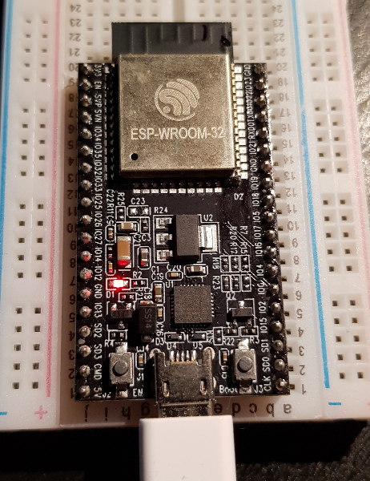
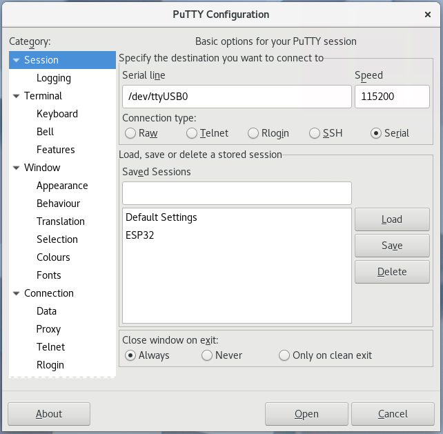
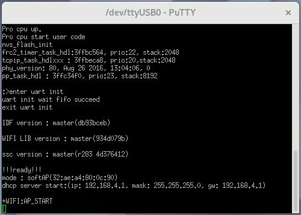

## Connect ESP32 with linux
#### 2018/01/28 GuntherVD

The ESP32 i am using for this guide is the [Espressif ESP32 DevKitC](https://www.espressif.com/en/products/hardware/esp32-devkitc/overview). Left from the usb connector is the EN button and right the BOOT button. More on thet later.



Unlike windows, linux don't have com1, com2 and so on. In Linux devices are found in the /dev/ directory. In order to find the port of our ESP32 we unplug the ESP32 and type in a prompt:

```
# ls /dev/tty*
```

Now Connect your ESP32 and repeat the previous command

```
# ls /dev/tty*
```

The new device is your ESP32. in my case it is /dev/ttyUSB0. Now we need to add our user to the usergroup that may connect to the serial devices. In order to find this usergroup we use the following command. Replace ttyUSB0 with the devicename you found.

```
# stat /dev/ttyUSB0
```

In the reply you find something like `Gid:( 14/ uucp)` so for Archlinux the group will be uucp. In other distributions you may need to use something else like `dialout` for example.

Next you need root access. Let's add our user in the group. Make sure you replace the group and if the user is not your current account the user aswell.

```
sudo usermod -a -G uucp $USER
```

Before you can use the serial connections you need to logout and login.

For the connection i use [Putty](https://www.putty.org/). You can use any terminal software of your liking. If you need to install putty do it now. Remember! This command works for Archlinux. Change it if you use a different distribution.

```
# sudo pacman -S putty
```

Now start putty.

Select Serial for Connection type. For the serial line fill the device you found before. For me this is /dev/ttyUSB0 and the port is 115200. Optional you may save the session by typing in a name in the Saved Sessions field and click save. As you can see in the example i saved my session as ESP32. Finaly click Open to connect your ESP32.



Next thing you will see is a empty terminal. Dont be scared, this is normal.
Press the EN button left from the usb connector. Now you will see some communication between your computer and the ESP32.
Congrats your ESP32 is connected to your Linux.



[back](./)


